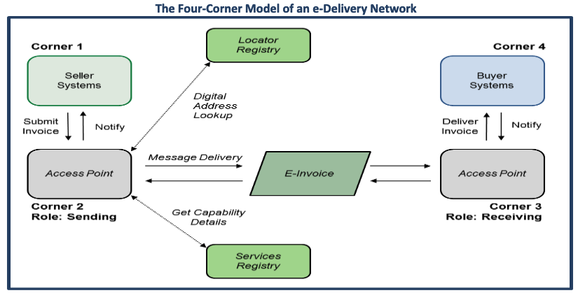

# About the E-Invoice Onboarding Toolkit

#### About  
This project offers examples of Python code written to interact with an access point or discovery service of a Four-Corner Model.   

Please see the [Business Payments Coalition](https://businesspaymentscoalition.org/electronic-invoices/) website for more information and an [overview of the Model](https://businesspaymentscoalition.org/wp-content/uploads/20191031-bpc-overview.pdf).  

#### Assumptions  

##### The Four-Corner Model  
The software included with the project assumes a baseline understanding of the Four-Corner Model and its constituent components.  
<figure markdown>
  
  <figcaption></figcaption>
</figure>

##### Python     
The primary programming language chosen for the project is Python.  To implement and run the code in [this project](https://github.com/BPC-OpenSourceTools/E-Invoice-Onboarding-Toolkit) requires a working knowledge of Python. This wiki and additional documentation are intended to further outline how the software is designed to implement the Four-Corner Model.  

 
 
 