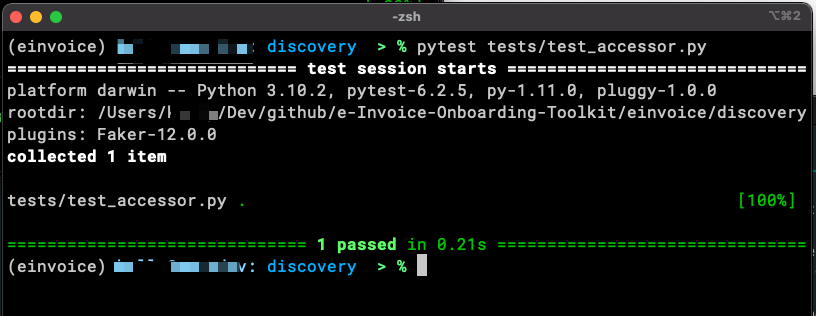
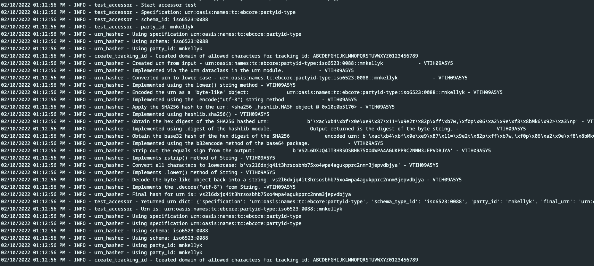

# Start-to-Finish


## Start-to-Finish Integration

There is not currently an "end-to-end" test for the E-Invoice Four-Corner Model to validate the workflow in its entirety.  

The next best use case is a "Start-to-Finish" of the discovery process.  

Discovery validation entails testing:  
1. The hashing functionality to derive the URN for look-up from the specification, the party ID, and the schema ID.  
2. Executing the DNS NATPR lookup and extracting the relevant SMP URI.  
3. Constructing the two REST requests including the __smp service group url__ and the __smp service url__.  
4. Executing the two REST requests to the SMP server.  
5. Extracting the Corner 3 endpoint URI from the response from the SMP server.   

This funcitonality is provided in the accessor.py module and validation is done in a single test case called test_accessor.py.

Execute the "Start-to-Finish" test as reference in the [more detailed instructions for running the test cases](./test_cases.md).
```
./einvoice/discovery/pytest tests/test_accessor.py
```


<figure markdown>
  
  <figcaption>Successful completion of "Start-to-Finish" test case.</figcaption>
</figure>


Further review and analysis of the the Start-to_Finish process can be found in the app.log which for the accessor.py module resides in the ./einvoice/discovery directory.

<figure markdown>
  
  <figcaption>Successful completion of "Start-to-Finish" test case recorded in the app.log file.</figcaption>
</figure>


<br/>
<br/>
<br/>