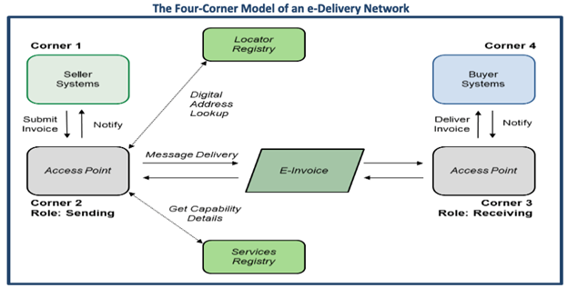

# e-Delivery Onboarding Toolkit   
This is a repository for open source software tools created to facilitate market adoption of the Digital Business Networks Alliance (DBNA)Document Exchange Framework, which is a four corner model of an e-Delivery Network.   
  
## Background
An overall understanding of a four-corner model of an e-Delivery Network before beginning the project is a prerequisite to beginning the project.

The exchange framework involves two network processes, discovery and delivery. The code for these two processes is included in this toolkit.  
  
 The discovery process includes the processes and technology used to discover (e.g., look up) the capabilities of another party, where and how to send an invoice and/or other messages and validate and authenticate credentials. This includes registry services and other decentralized discovery mechanisms. It takes place when the sending access point pings the locator registry (the Service Metadata Locator, or SML) to get the address of the receiving access point’s services registry (the Service Metadata Publisher or SMP.) The SMP provides details about a selected participant’s access point for receiving electronic business documents and of its capabilities to receive specific document types and to support related business processes.   
    
 The delivery process is the actual end-to-end message delivery between the sending and receiving access points.
     
Operation of the e-Delivery network is explained in greater detail at [BPC Framework Overview](https://github.com/BPC-Exchange-Framework/BPC-Market-Pilot/blob/main/BPC%20Framework%20Overview.pdf).  
     
## Prerequisites  
     
The code for this project is stored on GitHub. The developer must have experience working in Python.   

__Tool__ | __Minimum requirement__
------ | ------
Programming language | Python 3.6 or above, Python 3.10 recommended
Computer | Supports running Python 3.6 or above
OS|Mac, Windows or Windows w/WSL2
Programming resources | [BPC-Exchange-Framework/e-Invoice-Onboarding-Toolkit](https://github.com/BPC-Exchange-Framework/e-Invoice-Onboarding-Toolkit)  
  
  
## Installing   
Download the code from [BPC-Exchange-Framework/e-Invoice-Onboarding-Toolkit](https://github.com/BPC-Exchange-Framework/e-Invoice-Onboarding-Toolkit).

## Project Goals
???+ Alert "GOALS: The features of the project as outlined in the [project roadmap](./project_roadmap.md). "
    Roadmap Feature | Feature Phase | Purpose of Feature  
    ------ | ------ | ------
    Feature #1 - SML NAPTR DNS Lookup | Discovery |  1.  Create an ID code based on the Buyer's party ID    2. Look up the ID code up in a global internet database to get the address of a website which has more information about the Buyer.
    Feature #2 - SMP REST API Query | Discovery |  3. Contact the website  from the previous step to make sure the Buyer can in fact handle receiving an e-invoice and where to send it. |
    Feature #3 - AS4 Message header format validation.  | Delivery |  4. Validate that an e-mail message sent to the Buyer is in the correct format.  

## Project Outcomes

???+ Important "OUTCOMES: How the features are implemented."  
    Outcome | Feature | Phase  
    ------ | ------ | ------
    1. Hashing functionality to derive the URN for look-up in a DNS NAPTR record.  | Feature #1 | Discovery
    2. Execute DNS NATPR lookup and extract the relevant SMP URI.  | Feature #1 | Discovery
    3. Two REST requests to an SMP server using a REST API to retrieve a Corner 3 URI. | Feature #1 | Discovery
    4. Execute the web service requests to the SMP server. | Feature #2 | Discovery
    5. Extract the Corner 3 endpoint URI from the response from the SMP server.      | Feature #2 | Discovery
    6. Validate an E-Invoice ebMS message header for compliance with an AS4 conformance profile. | Feature #3| Delivery

For information about E-Invoices and the Four-Corner Model please visit the [Business Payments Coalition website](https://businesspaymentscoalition.org/electronic-invoices).  

 Additional documentation, reference materials, and standards can be found on the [Oasis-Open.org website](https://www.oasis-open.org). Start with the [ebXML specification](http://docs.oasis-open.org/ebxml-msg/ebms/v3.0/core/os/ebms_core-3.0-spec-os.html)

## Site Map

* [Project Home](./index.md)
* [FAQ](./faq.md)
* [Outcomes](./outcomes.md)
* [Assumptions](./assumptions.md)
* [Tools and Resources](./tools_and_resources.md)
* [Configure a Python Environment](./python_dev_env.md)
* [Package Requirements](./requirements.md)
* [Getting the Code](./working_with_the_code.md)
* Using the Code
    * [SML Hash Functionality](./sml_hash_func)
    * [DNS Query for SML urn](./dns_query_sml)
    * [SMP REST API Query](./smp_rest_query)
    * [Test Cases](./test_cases.md)
    * [Discovery Validation](./discovery_validation.md)
    * [JupyterLab/Notebooks](./google_colab_pages.md)
* [Project Artifacts](./artifacts.md)
* [Workflow](./git_workflow.md)
* [Glossary of Terms](./glossary.md)
* [Standards](./standards.md)
* [License](./_license.md)

