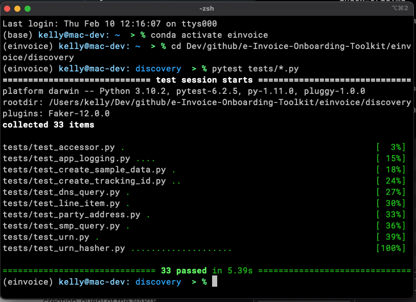

# e-Invoice Onboarding Tool-kit
## Working with the code
### Test Cases

Every module includes a test module in the einvoice/test directory.  

???+ note "Test cases are writen as functions, not classes."
    The test cases are written as functions and __CAN__ be directly called from the command line.  


???+ Important "Use Pytest to run the test cases."
    The use case for the test cases include using Pytest.  
     __The Pytest package must be installed in your Python distribution.__

From the a terminal console, change directory into the ./einvoice/test  directory.  

To see the list of available test files, either in your file browser or via the command line
```
("dir .\einvoice\tests\" or "ls -al ./einvoice/tests/").
```


???+ Important "The ./test directory __must__ be at the same level as the code."
     Out of the box, Pytest requires that without additional configuration it must be executed from  a directory at the same level of the code that's being tested.  That is, test scripts are in ./einvoice/test and code files are in ./einvoice/discovery and ./einvoice/delivery.   

Pytest will automatically look for files formatted as test files, with "test" in the lead of the filename.  To execute an inidivdual test the syntax is:
```
pytest test_app_logging.py
```

No test is dependent on any other, and each may be run on its own, or run them all at once, in any order.  


The test will run and either the "assert" statement(s) inside will pass, or it will fail.  

Failures MUST be resolved prior to attempting to check code into GitHub as our baseline CI/CD process checks for these failures before committing and will not continue if any are found.

The included assert statements currently test a variety of cases up to validation of urn creation, query of the NAPTR DNS record, REST API call to the SMP, and validation of the ebMS header against the AS4 conformance profile.  

The test folder also contains a number of shell scripts to validate the code using  a number of linters including flake8, pylint, mypy, pycodestyte, and pydocstyle.   Prior to check in, all code has had warnings from all linters resolved or noted.  

<figure markdown>
  
  <figcaption>Successful completion of all test cases.</figcaption>
</figure>


<div style="font-size: 12px;
            padding: 15px;
            border: 2px solid lightgray;
            margin-top: 100px;
            margin-left: 0px;
            margin-bottom: 40px;
            margin-right: auto;
            width: 100%;
            border-radius: 10px;">
  <h4 style="font-size: 14px;
            padding: 0px;
            margin: 0px;">No Representations or Warranties</h5>
  THE SOFTWARE IS PROVIDED "AS IS", WITHOUT WARRANTY OF ANY KIND, EXPRESS OR IMPLIED, INCLUDING BUT NOT LIMITED TO THE WARRANTIES OF MERCHANTABILITY, FITNESS FOR A PARTICULAR PURPOSE AND NONINFRINGEMENT. IN NO EVENT SHALL THE AUTHORS OR COPYRIGHT HOLDERS BE LIABLE FOR ANY CLAIM, DAMAGES OR OTHER LIABILITY, WHETHER IN AN ACTION OF CONTRACT, TORT OR OTHERWISE, ARISING FROM, OUT OF OR IN CONNECTION WITH THE SOFTWARE OR THE USE OR OTHER DEALINGS IN THE SOFTWARE.
</div>
